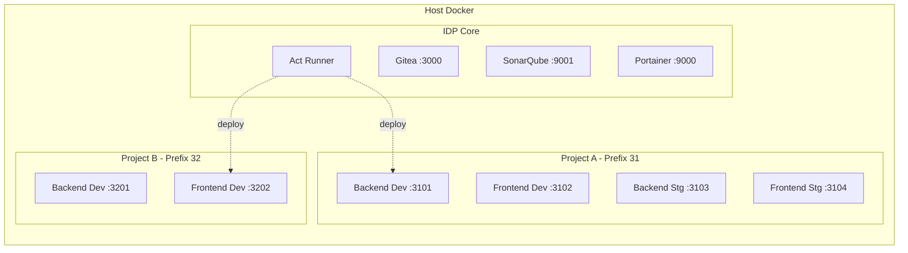

# Internal Developer Platform (IDP) Infrastructure

Esta é a configuração de infraestrutura centralizada (IDP) que suporta múltiplos projetos isolados. A infraestrutura inclui:
- **Gitea**: Gerenciamento de código (Clone do GitHub) ultra rápido e leve.
- **Act Runner**: Execução de pipelines (Gitea Actions - mesma sintaxe do GitHub Actions) e deploy de containers.
- **SonarQube**: Análise contínua da qualidade do código.
- **Portainer**: Monitoramento e gestão central de todos os containers (infra e projetos).

## 🚀 Como Iniciar

A arquitetura e os comandos foram automatizados usando o `Makefile` e compatíveis com o `magerc.json`.

Para iniciar toda a infraestrutura, execute:
```bash
make start
# Ou se estiver usando mage: mage run "Start Infrastructure"
```

O script irá:
1. Subir os containers (`gitea_db`, `gitea`, `sonarqube_db`, `sonarqube`, `portainer`).
2. Aguardar o Gitea ficar pronto.
3. Extrair automaticamente o token e iniciar o `gitea-runner`.

### Acessos Iniciais
- **Gitea**: [http://localhost:3000](http://localhost:3000)
  - Um usuário administrador padrão é criado automaticamente pelo script.
  - Credenciais iniciais: `admin` / `admin`
- **SonarQube**: [http://localhost:9001](http://localhost:9001)
  - Credenciais iniciais: `admin` / `admin` (será solicitado a alteração no primeiro login).
- **Portainer**: [http://localhost:9000](http://localhost:9000)
  - No primeiro acesso, crie seu usuário admin. O Portainer já está conectado ao Docker local.

## 📦 Criando um Novo Projeto

Para inicializar um novo projeto compatível com a plataforma, use o comando `create-project`:

```bash
make create-project NAME=meu-novo-projeto PREFIX=31
```

Isso fará o seguinte:
1. Criará uma pasta `../meu-novo-projeto` (fora do diretório da infra).
2. Copiará os templates de CI/CD (`.gitea/workflows/deploy.yaml`), docker-compose e SonarQube para a nova pasta.
3. Substituirá os nomes nos arquivos.

### Próximos passos no Gitea
1. Crie um novo repositório no Gitea com o nome do seu projeto.
2. Adicione os arquivos gerados e faça o push.
3. Vá em **Settings > Actions > Secrets** e adicione os seguintes secrets:
   - `DEV_PORT_BACK` (Ex: `3101`)
   - `DEV_PORT_FRONT` (Ex: `3102`)
   - `STG_PORT_BACK` (Ex: `3103`)
   - `STG_PORT_FRONT` (Ex: `3104`)
   - `PRD_PORT_BACK` (Ex: `3105`)
   - `PRD_PORT_FRONT` (Ex: `3106`)
   - `SONAR_HOST_URL` = `http://sonarqube:9000` (Comunicação interna do container)
   - `SONAR_TOKEN` = (Gere no SonarQube em *My Account > Security*)

## 🏗️ Arquitetura e Fluxo de CI/CD

O fluxo permite isolar cada ambiente. Todos os containers são criados no mesmo host, mas gerenciados via Portainer.



### O Pipeline (`.gitea/workflows/deploy.yaml`)
- **test-and-sonar**: Roda testes e análise do SonarQube.
- **build-and-deploy-develop**: Auto-deploy acionado em cada push para a branch `develop`. Realiza o build via socket do host.
- **build-and-deploy-manual**: Deploy acionado manualmente pelo botão "Run workflow" (*workflow_dispatch*) na aba Actions. Permite selecionar o ambiente desejado (staging ou production) para deploy.

---
**Nota sobre projetos existentes**: Projetos que já existem no seu workspace podem ser adaptados copiando a pasta `.gitea` gerada e ajustando os nomes das imagens Docker ou portas no compose conforme necessidade.
