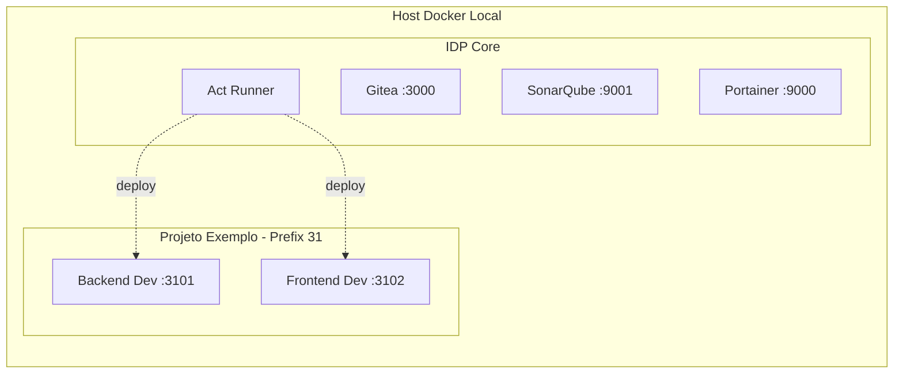

# 🚀 Plataforma Interna de Desenvolvedor (IDP)


Bem-vindo à nossa **Plataforma Interna de Desenvolvedor (IDP)**! Esta é uma infraestrutura centralizada e leve projetada para rodar localmente ou em um servidor dedicado, fornecendo todas as ferramentas essenciais para o ciclo de vida do desenvolvimento de software, desde o versionamento de código até o deploy e análise de qualidade.

---

## 🛠️ Tecnologias Utilizadas

Esta infraestrutura foi construída pensando em simplicidade, isolamento e performance:

*   **[Gitea](https://gitea.io/)**: Nosso servidor Git super rápido e leve. Inclui o **Act Runner** integrado para rodar pipelines (compatível com a sintaxe do GitHub Actions).
*   **[SonarQube](https://www.sonarqube.org/)**: Plataforma para inspeção contínua da qualidade e segurança do código.
*   **[Portainer](https://www.portainer.io/)**: Interface gráfica amigável para gerenciamento de todos os nossos containers Docker.
*   **[PostgreSQL](https://www.postgresql.org/)**: Banco de dados relacional robusto utilizado como backend para o Gitea e SonarQube.
*   **[Docker & Docker Compose](https://www.docker.com/)**: O coração da infraestrutura, garantindo que tudo rode em containers isolados e fáceis de gerenciar.
*   **Make & Bash**: Scripts de automação (`Makefile` e `.sh`) para que você não precise decorar comandos complexos.

---

## 📋 Pré-requisitos

Antes de começar, certifique-se de ter instalado em sua máquina:

1.  **Docker** (e Docker Compose)
2.  **Make** (Geralmente nativo no Linux/macOS. No Windows, use o WSL2)
3.  **Bash** (Terminal padrão em sistemas baseados em Unix)

---

## 🚀 Passo a Passo: Subindo a Infraestrutura

Subir todo esse ecossistema é extremamente simples.

**1. Clone e entre no repositório:**
```bash
git clone <URL_DO_REPOSITORIO> infra-project
cd infra-project
```

**2. Inicie a mágica:**
```bash
make start
```
*(Se estiver usando mage, pode usar: `mage run "Start Infrastructure"`)*

**O que esse comando faz por você?**
*   Inicia os bancos de dados PostgreSQL.
*   Sobe o Gitea, SonarQube e Portainer.
*   Aguarda o Gitea ficar pronto.
*   Extrai os tokens necessários e registra automaticamente o Runner de CI/CD (Gitea Actions).

---

## 🌐 Acessos e Credenciais Padrão

Assim que os containers estiverem rodando, você pode acessar as ferramentas através do seu navegador:

| Ferramenta | URL | Usuário Padrão | Senha Padrão | Notas |
| :--- | :--- | :--- | :--- | :--- |
| **Gitea** | [http://localhost:3000](http://localhost:3000) | `admin` | `admin` | Conta criada automaticamente. |
| **SonarQube** | [http://localhost:9001](http://localhost:9001) | `admin` | `admin` | Pedirá para trocar a senha no 1º login. |
| **Portainer** | [http://localhost:9000](http://localhost:9000) | - | - | Crie seu admin no primeiro acesso. |

---

## 📦 Criando um Novo Projeto

Esta infraestrutura já vem preparada para inicializar novos projetos com CI/CD e análise de código configurados.

Para criar um novo projeto compatível:

```bash
make create-project NAME=meu-novo-projeto PREFIX=31
```

*   `NAME`: O nome da pasta e do projeto.
*   `PREFIX`: Um número de dois dígitos que define o bloco de portas deste projeto (ex: 31 alocará portas 31xx). **Isso garante que vários projetos rodem simultaneamente sem conflito de portas.**

**O que o comando faz:**
*   Cria a pasta `../meu-novo-projeto` (no mesmo nível da pasta da infraestrutura).
*   Gera arquivos `docker-compose` base.
*   Gera a configuração do **SonarQube** (`sonar-project.properties`).
*   Configura os pipelines do Gitea (`.gitea/workflows/deploy.yaml`).

### ⚙️ Configuração Pós-Criação (No Gitea)

1. Acesse o **Gitea** e crie um novo repositório chamado `meu-novo-projeto`.
2. No seu terminal, faça o commit e push dos arquivos gerados para este repositório.
3. No Gitea, vá em **Settings > Actions > Secrets** do seu repositório e configure as variáveis necessárias:
   * `DEV_PORT_BACK` (Ex: `3101`)
   * `DEV_PORT_FRONT` (Ex: `3102`)
   * `STG_PORT_BACK` (Ex: `3103`)
   * `STG_PORT_FRONT` (Ex: `3104`)
   * `PRD_PORT_BACK` (Ex: `3105`)
   * `PRD_PORT_FRONT` (Ex: `3106`)
   * `SONAR_HOST_URL` = `http://sonarqube:9000` (URL interna do container)
   * `SONAR_TOKEN` = *(Gere um token no SonarQube em My Account > Security)*

---

## 🏗️ Como Funciona o CI/CD?

A plataforma utiliza o Gitea Actions. Quando você cria um projeto com `make create-project`, um pipeline é gerado com os seguintes fluxos:

1.  **Test & Sonar (`test-and-sonar`)**: Roda automaticamente em Pull Requests e pushes, realizando testes e enviando as métricas para o SonarQube.
2.  **Auto Deploy Dev (`build-and-deploy-develop`)**: Todo código mergeado na branch `develop` sofre build e deploy automático no ambiente de desenvolvimento local.
3.  **Manual Deploy Stg/Prd (`build-and-deploy-manual`)**: Deploys para Staging ou Produção são manuais. Vá na aba **Actions** do Gitea, selecione o workflow e escolha o ambiente desejado.

### Arquitetura Visual



---

## 🛑 Parando a Infraestrutura

Para pausar os serviços (sem perder dados):
```bash
make stop
```

Para destruir completamente a infraestrutura (🚨 **Isso apagará todos os repositórios e dados do banco**):
```bash
make teardown
```

---
*Construído com ♥️ para simplificar a vida do desenvolvedor.*
